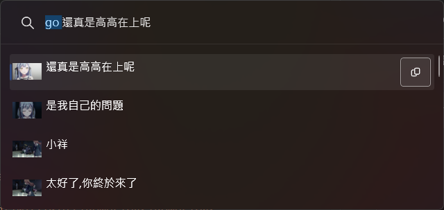
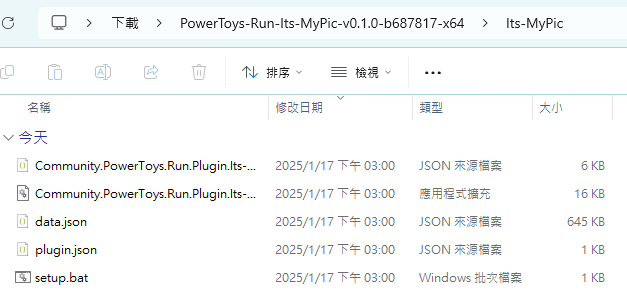
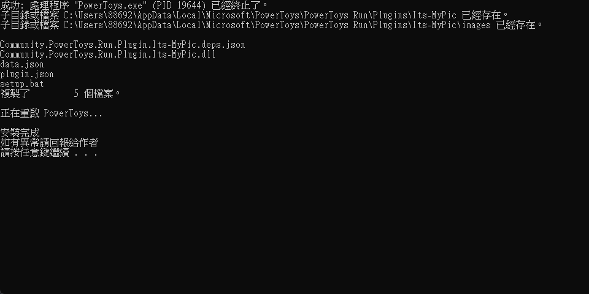
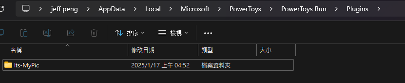

# PowerToys Run Plugin: IT's MyPic!!!!!

[中文](./README_ZH-TW.md)

A [PowerToys Run](https://learn.microsoft.com/zh-tw/windows/powertoys/run) plugin to quick copy screenshot.

## Features
 * Search and copy screenshot
 * Memory frequently used Screenshot
 * Also can copy dialogue

## Installation
### using setup script
1. Download the latest release of the from the [releases page](releases).
2. Extract the `.zip` file and open folder

    

3. run `setup.bat`
    
    

> please run `setup.bat` as administrator if prompted `Failed to kill PowerToys`.

### manual Install
1. Download the latest release of the from the [releases page](releases).
2. Extract the `.zip` file's contents to `%LocalAppData%\Microsoft\PowerToys\PowerToys Run\Plugins`

    

3. Restart PowerToys.

## Usage
1. Open PowerToys Run (default shortcut is `Alt+Space`).
2. Type `go` and search screenshot what you want.

## How To Build
1. Make sure you have enable [sudo](https://learn.microsoft.com/zh-tw/windows/sudo/) and configure to normal mode.
2. Press `debug` to start testing.

    

